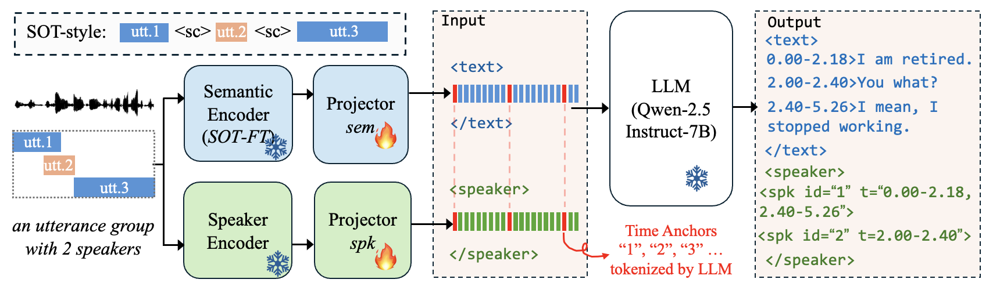

# LLM for Multi-Speaker ASR and Diarization

> **Anonymous Submission Statement**  
> This repository has been anonymized for peer review purposes. All personally identifiable information, including author names, affiliations, email addresses, and institutional references, has been removed from the codebase and documentation. The framework name has been generalized to maintain anonymity. Third-party copyright notices and citations to prior work have been preserved as required.

---

This project implements a fully end-to-end multi-speaker ASR and diarization framework using the LALM model with dual audio encoder streams and a numeric time anchor mechanism for precise timestamp prediction.

<video src="examples/diarization/assets/demo.mp4" controls="controls" style="max-width: 100%;">
</video>

If Demo is not displayed automatically, download it here: [Watch the demo](examples/diarization/assets/demo.mp4) (669 KB)

The model takes raw waveform of multi-speaker conversation and directly outputs a structured output containing timestamps, speaker labels, gender, and speaker-attributed ASR transcription.

<p align="center">
  
</p>


The model uses:
- **Dual Encoders**: Semantic encoder fine-tuned by Serialized Output Training (SOT) for content understanding + Voice encoder for speaker identity
- **Dual Projectors**: Separate projection heads for each encoder
- **Numeric Anchors**: Digit embeddings (1, 2, 3, ...) inserted at regular intervals to improve temporal awareness and synchronization between semantic and voice features
- **LLM Backend**: Qwen2.5-7B-Instruct for sequence modeling. Frozen during training.

## Installation

### Basic Requirements

Install the core dependencies:

```bash
pip install -r requirements.txt
```

### Additional Requirements for Diarization

For the diarization example, install additional packages:

```bash
pip install meeteval scipy
```

- **meeteval**: For computing cpWER (concatenated minimum-permutation word error rate) and DER (diarization error rate) metrics
- **scipy**: For optimal speaker matching when using the Hungarian algorithm when calculating gender accuracy (optional)


## Quick Start

All commands should be run from the `examples/diarization/` directory:

```bash
cd examples/diarization
```

### Step 1: Generate Time Anchor Embeddings

Before training, generate numeric anchor embeddings from a pretrained LLM:

```bash
python utils/generate_anchor_embeddings.py \
    --model_path /path/to/Qwen2.5-7B-Instruct \
    --output_path utils/digit_token_embeddings.pt
```

This creates `digit_token_embeddings.pt` which is required for training.

### Step 2: Training

```bash
# Train on AMI dataset
./scripts/train_AMI.sh

# Train on AliMeeting dataset
./scripts/train_AliMeeting.sh
```

### Step 3: Decoding

```bash
# Decode AMI test set
./scripts/decode_AMI.sh

# Decode AliMeeting test set
./scripts/decode_AliMeeting.sh
```

### Step 4: Evaluation

```bash
# Evaluate results with cpWER and DER metrics
python evaluate.py --xml_file /path/to/exp/output_xml.txt
```

The evaluation outputs the following metrics:
- **cpWER**: Concatenated minimum-permutation word error rate (speaker-aware ASR)
- **Global WER**: Speaker-agnostic word error rate (pure ASR)
- **DER**: Diarization error rate with miss/false alarm/confusion breakdown
- **Gender Accuracy**: Time-weighted gender prediction accuracy
- **Speaker Count**: Exact match rate and mean absolute error for number of speakers

### Step 5: Training Semantic Encoder with SOT (Optional)

We also provide a complete ASR example with **Serialized Output Training (SOT)** implementation, specifically designed for fine-tuning the semantic encoder with speaker change prediction capabilities.

SOT trains the encoder to predict `<sc>` (speaker change) tokens along with transcription, which improves the model's awareness of speaker boundaries and enhances performance in multi-speaker scenarios.

**For complete SOT training instructions and implementation details, please refer to:**
- [examples/asr/README_SOT.md](examples/asr/README_SOT.md)

**Quick Start for SOT Training:**

```bash
cd examples/asr

# Train encoder with SOT on your dataset
torchrun --nproc_per_node=1 train_sot.py \
  --config-name train_sot \
  exp_dir=experiments/sot_encoder \
  tokenizer=bert-base-chinese \
  data.train_data_config=configs/data_configs/train_data_config.yaml \
  data.valid_data_config=configs/data_configs/valid_data_config.yaml \
  sot_training=true
```

After SOT fine-tuning, you can use the trained encoder as the semantic encoder in the diarization model by setting `model.audio_encoder.pretrained_model` in the diarization config.


## Data Preparation and Format

We use the [Lhotse](https://github.com/lhotse-speech/lhotse) toolkit to prepare audio manifests with multi-speaker supervision for both **AMI** and **AliMeeting** datasets.

### Step 1: Download and Prepare Datasets

To download and prepare the datasets, please follow the official Lhotse recipes:

- **AMI**: [ami.py](https://github.com/lhotse-speech/lhotse/blob/master/lhotse/recipes/ami.py)
- **AliMeeting**: [ali_meeting.py](https://github.com/lhotse-speech/lhotse/blob/master/lhotse/recipes/ali_meeting.py)

After generating recordings and supervision manifests, we further segment multi-speaker audio using Lhotse's [`MultiCut.trim_to_supervision_groups`](https://lhotse.readthedocs.io/en/latest/api.html#lhotse.cut.MultiCut.trim_to_supervision_groups) function.

This step groups overlapping speaker turns into a single utterance-level segment while preserving speaker annotations.

### Step 2: Custom Dataset (Optional)

If you prepare your own multi-speaker meeting-style dataset, we recommend following a similar **utterance-group segmentation** strategy as described in the paper: https://arxiv.org/abs/2211.00482

Each segment should be represented as a `MonoCut` containing multiple speaker turns (supervisions).

### Manifest Format

Below is an example of a `MonoCut` stored in JSON format.  
Each cut contains one recording and multiple supervisions (speaker turns).  

```json
{
  "id": "ES2004b-0-0-6",
  "start": 80.31,
  "duration": 3.09,
  "channel": 0,
  "supervisions": [
    {
      "id": "ES2004b-1",
      "recording_id": "ES2004b",
      "start": 0.0,
      "duration": 1.21,
      "channel": [0],
      "text": "UH NO THAT'S OKAY SORRY",
      "language": "English",
      "speaker": "FEE016",
      "gender": "F"
    },
    {
      "id": "ES2004b-171",
      "recording_id": "ES2004b",
      "start": 0.96,
      "duration": 2.13,
      "channel": [0],
      "text": "OKAY UM",
      "language": "English",
      "speaker": "FEE013",
      "gender": "F"
    }
  ],
  "recording": {
    "id": "ES2004b",
    "sources": [
      {
        "type": "file",
        "channels": [0],
        "source": "/path/to/audio/ES2004b.Array1-01.wav"
      }
    ],
    "sampling_rate": 16000,
    "num_samples": 37527894,
    "duration": 2345.493375,
    "channel_ids": [0]
  },
  "type": "MonoCut"
}
```

### XML-like Representation

During training and inference, each example is converted into an XML-like representation that decouples textual content and speaker metadata. This format supports our model's disentangled dual streams, time anchoring, and efficient token representation:

```xml
<text>
0.00-1.21>UH NO THAT'S OKAY SORRY
0.96-2.13>OKAY UM
</text>
<speaker>
<spk id="1" g="f" t="0.00-1.21"/>
<spk id="2" g="f" t="0.96-2.13"/>
</speaker>
```
